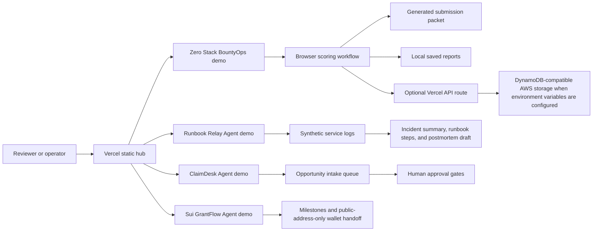

# Hackathon Launchpad Architecture Diagram

Status: submission support asset.

This repository contains several small hackathon demos under one public Vercel hub. The H0 submission uses the Zero Stack BountyOps demo.

## Notes

- The public demo is hosted at `https://hackathon-launchpad-demos.vercel.app`.
- Source code is public at `https://github.com/sevencat2004/hackathon-launchpad-demos`.
- The H0 demo can run as a static browser app. The optional API route is prepared for AWS-backed storage once eligible AWS environment variables are configured.
- User-owned actions such as account access, final submission, tax, KYC, and payment setup stay outside the application.
