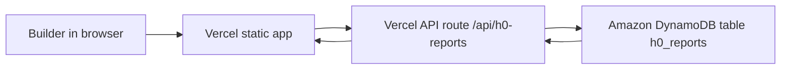

# H0 AWS Evidence Template

Status: template only, not submitted, not approved, not paid.
Price: 80,000 USD cash prize pool.

Use this only after a real AWS database has been created and verified.

## Database choice

```text
Amazon DynamoDB
```

## Database role in the project

```text
Zero Stack BountyOps uses Amazon DynamoDB as the primary backend for saved opportunity reports. The browser app runs on Vercel, the Vercel API route receives report saves, and DynamoDB stores the structured records.
```

## Architecture



## Required screenshots

- DynamoDB table list showing `h0_reports`.
- DynamoDB table detail showing partition key `id`.
- Vercel Environment Variables page showing variable names with secret values hidden.
- H0 demo page after a report save.
- Architecture diagram.

## Vercel environment variables

Do not paste secret values into this file.

```text
AWS_REGION=us-east-1
AWS_ACCESS_KEY_ID=<stored in Vercel only>
AWS_SECRET_ACCESS_KEY=<stored in Vercel only>
H0_REPORTS_TABLE=h0_reports
```

## Submission wording after real AWS is connected

```text
The project uses Amazon DynamoDB as its primary backend for saved opportunity reports. Vercel hosts the app and serverless API route, and the API writes structured report records to the DynamoDB table. The demo shows the workflow from scoring an opportunity to saving the report through the AWS-backed route.
```

## Demo video note after real AWS is connected

The demo video should show:

1. H0 page open on Vercel.
2. Opportunity scoring.
3. Saving a report.
4. A brief view of the DynamoDB table with secret values hidden.
5. A short explanation that DynamoDB is the primary backend.

## Current blocker

The user has confirmed that no AWS account is available right now. Until AWS is available and the evidence above is captured, H0 should remain draft-only and should not be final-submitted.
