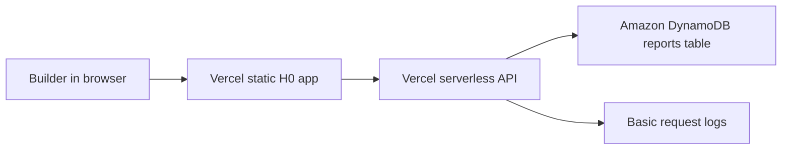

# H0 AWS compliance plan

Status: compliance gap identified, not submitted, not approved, not paid.
Price: 80,000 USD cash prize pool.

## Official requirement snapshot

- Devpost page: `https://h01.devpost.com/`
- Rules page: `https://h01.devpost.com/rules`
- Official rule checked on 2026-06-04: the project must use at least one AWS database as its primary backend. Eligible choices include Amazon Aurora, Amazon Aurora DSQL, and Amazon DynamoDB.
- Official submission fields checked on 2026-06-04 include Vercel project link, Vercel Team ID, architecture diagram, public repository, AWS Database usage screenshot, and a demo video.
- Official credit note checked on 2026-06-04: participants can request AWS promotional credits through the event flow, with deadline and usage terms controlled by the organizer/AWS.

## Current gap

The current H0 demo is a public static prototype deployed on Vercel:

- Demo: `https://hackathon-launchpad-demos.vercel.app/h0/`
- Repo: `https://github.com/sevencat2004/hackathon-launchpad-demos`

It is good enough for a draft project page and reviewer discussion, but it is not final-submit ready for H0 until AWS database usage is added and evidenced.

## Preferred implementation

Use Amazon DynamoDB as the primary backend for saved opportunity reports.

Why DynamoDB:

- Fits the current app shape: small structured report records.
- Avoids Aurora cluster setup and database migration work.
- Easy to explain in the architecture diagram.
- Keeps private credentials server-side only.

## Proposed architecture

## Required user action

User must provide/authorize an AWS account path. Do not paste secrets in chat.

Acceptable paths:

1. User requests AWS promotional credits from the H0 event flow and confirms when available.
2. User confirms an AWS account can be used for a small DynamoDB table.
3. User creates a limited IAM access key outside chat and stores it only in Vercel Environment Variables when the project lead gives the exact variable names.

Do not send:

- AWS access key secret
- Root account credentials
- One-time codes
- Billing card details
- Tax/KYC details

## Vercel environment variables to prepare later

Do not fill these until the AWS account is ready:

- `AWS_REGION`
- `AWS_ACCESS_KEY_ID`
- `AWS_SECRET_ACCESS_KEY`
- `H0_REPORTS_TABLE`

## Final submission evidence still needed

- Architecture diagram screenshot or exported image.
- AWS DynamoDB table screenshot showing the reports table.
- Vercel Environment Variables screenshot with secrets hidden.
- Demo video showing saving a report through the AWS-backed flow.
- Updated README section explaining the AWS database usage.

## Decision

Create H0 Devpost draft now if useful, but stop before final submit. Final H0 submission is blocked until AWS database integration and evidence are complete.
