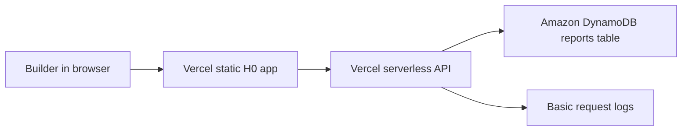

# H0 AWS compliance plan

Status: AWS DynamoDB verified; final Devpost review pending, not submitted, not approved, not paid.
Price: 80,000 USD cash prize pool.

Current user state checked on 2026-06-06: AWS credits are granted, v0 credits are redeemed, DynamoDB table `h0_reports` exists, Vercel environment variables are configured, and the public H0 save flow writes to DynamoDB.

## Official requirement snapshot

- Devpost page: `https://h01.devpost.com/`
- Rules page: `https://h01.devpost.com/rules`
- Official rule checked on 2026-06-04: the project must use at least one AWS database as its primary backend. Eligible choices include Amazon Aurora, Amazon Aurora DSQL, and Amazon DynamoDB.
- Official submission fields checked on 2026-06-04 include Vercel project link, Vercel Team ID, architecture diagram, public repository, AWS Database usage screenshot, and a demo video.
- Official credit note checked on 2026-06-04: participants can request AWS promotional credits through the event flow, with deadline and usage terms controlled by the organizer/AWS.

## Current state

The current H0 demo is a public prototype deployed on Vercel:

- Demo: `https://hackathon-launchpad-demos.vercel.app/h0/`
- Repo: `https://github.com/sevencat2004/hackathon-launchpad-demos`

It is ready for final Devpost page review. The code includes a DynamoDB-backed save route, and the public H0 page has been verified saving a report to DynamoDB table `h0_reports`.

## Preferred implementation

Use Amazon DynamoDB as the primary backend for saved opportunity reports.

Why DynamoDB:

- Fits the current app shape: small structured report records.
- Avoids Aurora cluster setup and database migration work.
- Easy to explain in the architecture diagram.
- Keeps private credentials server-side only.

## Proposed architecture

## User-owned boundaries

User must complete final Devpost submission and any tax/KYC/prize steps. Do not paste secrets in chat.

Do not send:

- AWS access key secret
- Root account credentials
- One-time codes
- Billing card details
- Tax/KYC details

## Vercel environment variables

Configured in Vercel with secret values hidden:

- `AWS_REGION`
- `AWS_ACCESS_KEY_ID`
- `AWS_SECRET_ACCESS_KEY`
- `H0_REPORTS_TABLE`

Implemented route:

- `projects\h0-zero-stack\api\h0-reports.js`
- Deployed path after build: `/api/h0-reports`
- Behavior: `POST` saves a report to DynamoDB when AWS variables are present; otherwise the browser keeps local draft storage and shows a cloud-write failure message.

## Final submission evidence

- Architecture diagram screenshot or exported image.
- AWS DynamoDB table screenshot showing the reports table: captured by user.
- Vercel Environment Variables screenshot with secrets hidden: captured by user.
- H0 demo page showing `Saved to DynamoDB table h0_reports`: captured by user.
- Demo video showing saving a report through the AWS-backed flow: update if Devpost reviewers need a fresh video.
- Updated README section explaining the AWS database usage.

## Decision

Proceed to final Devpost page preparation and project-lead review. Stop before final submit until the user shares the final page screenshot.
